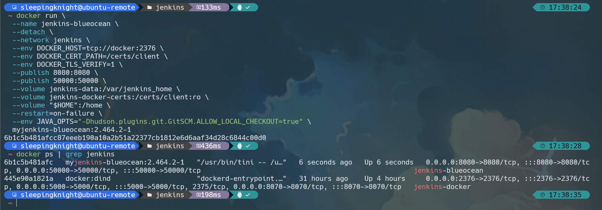

# Part 1: Running Jenkins in Docker
**Step 1:** Create a network bridge in Docker using the following command.
```shell
docker network create jenkins
```


**Step 2:** We will run the React App using a Docker container in a Docker container (more precisely in a Blue Ocean container). This practice is called dind, aka `docker in docker`. So, please download and run `docker:dind` Docker image using the following command.
```shell
docker run \
  --name jenkins-docker \
  --detach \
  --privileged \
  --network jenkins \
  --network-alias docker \
  --env DOCKER_TLS_CERTDIR=/certs \
  --volume jenkins-docker-certs:/certs/client \
  --volume jenkins-data:/var/jenkins_home \
  --publish 2376:2376 \
  --publish 3000:3000 --publish 5000:5000 \
  --restart always \
  docker:dind \
  --storage-driver overlay2
```


The following is an explanation of the command above.

- **--name:** Specifies the name of the Docker container that will be used to run the image.

- **--detach:** Runs the Docker container in the background. However, this instance can be stopped later by running the *docker stop jenkins-docker* command.

- **--privileged:** Running dind (docker in docker aka docker within docker) currently requires *privileged access* to function properly. This requirement may not be necessary with newer Linux kernel versions.

- **--network jenkins:** This corresponds to the network created in the previous step.

- **--network-alias docker:** Makes Docker within a Docker container available as a *docker* hostname within a *jenkins* network.

- **--env DOCKER_TLS_CERTDIR=/certs:** Enables the use of TLS on the Docker server. This is recommended because we are using a *privileged container*. This environment variable controls the root directory where Docker TLS certificates are managed.

- **--volume jenkins-docker-certs:/certs/client:** Maps the /certs/client directory inside the container to a Docker volume named jenkins-docker-certs.

- **--volume jenkins-data:/var/jenkins_home:** Maps the /var/jenkins_home directory inside the container to a Docker volume named jenkins-data. This will allow other Docker containers managed by this Docker container's Docker daemon to mount data from Jenkins.

- **--publish 2376:2376:** Expose the Docker daemon port on the host machine (your computer). This is useful for executing Docker commands on the host machine (your computer) to control the inner Docker daemon.

- **--publish 3000:3000 --publish 5000:5000:** Exposes ports 3000 and 5000 of the dind (docker in docker) container.

- **--restart always:** ensures the container restarts and stays up not only when there is a failure but also after the server in use has also restarted.

- **docker:dind:** This is the image of *docker:dind* itself. This image can be downloaded before running using the *docker image pull docker:dind* command.

- **--storage-driver overlay2:** Storage driver for Docker volumes. See the [Docker Storage drivers](https://docs.docker.com/storage/storagedriver/select-storage-driver) page for supported options.

It also mapping the Docker volume


**Step 3:** Create `Dockerfile` and copy the following contents to your Dockerfile.
```shell
FROM jenkins/jenkins:2.426.2-jdk17
USER root
RUN apt-get update && apt-get install -y lsb-release
RUN curl -fsSLo /usr/share/keyrings/docker-archive-keyring.asc \
  https://download.docker.com/linux/debian/gpg
RUN echo "deb [arch=$(dpkg --print-architecture) \
  signed-by=/usr/share/keyrings/docker-archive-keyring.asc] \
  https://download.docker.com/linux/debian \
  $(lsb_release -cs) stable" > /etc/apt/sources.list.d/docker.list
RUN apt-get update && apt-get install -y docker-ce-cli
USER jenkins
RUN jenkins-plugin-cli --plugins "blueocean:1.27.9 docker-workflow:572.v950f58993843"
```

**Step 4:** Create a new Docker image from the previous Dockerfile and name it `myjenkins-blueocean:2.426.2-1`.
```shell
docker build -t myjenkins-blueocean:2.426.2-1 .
```


**Step 5:** After that, run `myjenkins-blueocean:2.426.2-1` image as a container in Docker using the following command.
```shell
docker run \
  --name jenkins-blueocean \
  --detach \
  --network jenkins \
  --env DOCKER_HOST=tcp://docker:2376 \
  --env DOCKER_CERT_PATH=/certs/client \
  --env DOCKER_TLS_VERIFY=1 \
  --publish 8080:8080 \
  --publish 50000:50000 \
  --volume jenkins-data:/var/jenkins_home \
  --volume jenkins-docker-certs:/certs/client:ro \
  --volume "$HOME":/home \
  --restart=on-failure \
  --env JAVA_OPTS="-Dhudson.plugins.git.GitSCM.ALLOW_LOCAL_CHECKOUT=true" \
  myjenkins-blueocean:2.426.2-1 
```



The following is an explanation of the command above.
- **--name:** Specifies the name of the Docker container that will be used to run the image.

- **--detach:** Runs the Docker container in the background.

- **--network jenkins:** Connects this container to the previously created *jenkins* network. This makes the Docker daemon from the previous step available to this container via the *docker* hostname.

- **--env DOCKER_HOST=tcp://docker:2376:** Defines the environment variables used by *docker*, *docker-compose*, and other Docker tools to connect to the Docker daemon from the previous step.

- **--publish 8080:8080:** Map (publish/expose) port 8080 of the current container to port 8080 on the host machine (your computer). The first number represents the port on the host, while the last represents the port on the container. So, if you specify *-p 49000:8080* for this option, you will access Jenkins on the host machine via port 49000.

- **--publish 50000:50000:** Maps (exposes) port 50000 of the current container to port 50000 on the host machine (your computer). This is only necessary if you have set up one or more inbound Jenkins agents on another machine that interacts with your *jenkins-blueocean* container (the Jenkins "controller"). Inbound Jenkins agents communicate with the Jenkins controller via TCP port 50000 by default. You can change this port number on the Jenkins controller via the Configure Global Security page.

- **--volume jenkins-data:/var/jenkins_home:** Maps the container's */var/jenkins_home* directory to a Docker volume named jenkins-data.

- **--volume jenkins-docker-certs:/certs/client:ro:** Maps the container's /certs/client directory to a previously created volume named jenkins-docker-certs. This creates client TLS certificates to connect to the available Docker daemon at the path specified by the DOCKER_CERT_PATH environment variable.

- **--volume "$HOME":/home:** Maps the $HOME directory on the host machine (your computer, usually the */Users/your-username* directory) to the */home* directory on the container.

- **--restart=on-failure:** Configure the Docker container restart policy to restart when a failure occurs.

- **--env JAVA_OPTS="-Dhudson.plugins.git.GitSCM.ALLOW_LOCAL_CHECKOUT=true":** Allows checkout on local repositories.

- **myjenkins-blueocean:2.426.2-1:** The name of the Docker image you created in the previous step.


# Part 2: Setting up Jenkins Wizard
**Step 1:** Open your browser and run http://{{Public-IP}}:8080. Wait until the **Unlock Jenkins** page appears.

**Step 2:** As it says, you are required to copy the password from the Jenkins log to ensure that Jenkins is accessed safely by administrators. 

**Step 3:** Display the Jenkins console log with the following command in Terminal/CMD
```shell
docker logs jenkins-blueocean
```

**Step 4:** From the Terminal/CMD application, copy the password between the 2 series of asterisks.


**Step 5:** Return to the *Unlock Jenkins* page in the browser, paste the password into the **Administrator password** column and click **Continue**.

**Step 6:** After that, the Customize Jenkins page appears. Select **Install suggested plugins**. The setup wizard shows progress that Jenkins is being configured and recommended plugins are being installed. This process may take up to several minutes. <br>
**Note:** If there is a failure during the plugin installation process, you can click **Retry** (to repeat the plugin installation process until it is successful) or click **Continue** (to skip and proceed directly to the next step).

**Step 7:** Once done, Jenkins will ask you to create an administrator user. When the *Create First Admin User* page appears, fill it in according to your wishes and click **Save and Continue**.

**Step 8:** On the Instance Configuration page, select **Save and Finish**. That means, we will access Jenkins from the url http://{{localhost}}:8080/. 

**Step 9:** When the *Jenkins is ready* page appears, click the **Start using Jenkins** button.
Note: This page may indicate *Jenkins is almost ready!* If so, click **Restart**. If the page doesn't refresh automatically after a few minutes, manually click the *refresh* icon in your browser.

**Step 10:** If necessary, you can log back into Jenkins using the credentials you created earlier.


# Part 3: Running SonarQube in Docker
**Step 1:** We will use the free community edition image called **lts-community**. There is also a paid version available called the developer version.
```shell
docker run -d --name sonarqube -p 30002:9000 sonarqube:lts-community
```

The first 30002 is the host port (feel free to use another free port on your VM) which is mapped to the second 9000 port, the Docker container port. This is because the SonarQube service is exposed on port 9000. Use docker ps to view the status of the SonarQube container it should be Up and running.


**Step 2:** Now let's try to access the SonarQube service running inside a Docker container on the SonarQube VM on port 30002.

**Step 3:** Enter your initial username and password as **admin** for the SonarQube service. Then, update the default password to a strong one.


# Part 4: Running Nexus in Docker
**Step 1:** Nexus service runs on default port 8081 just like SonarQube service runs on default port 9000 and Jenkins service runs on default port 8080. Run the following command to run the Nexus service inside a Docker container instead of running it on the Nexus VM/node host.
```shell
docker run -d --name nexus -p 30003:8081 sonatype/nexus3
```

The first 30003 is the host port (feel free to use another free port on your VM) which is mapped to the second 8081 port, the Docker container port. This is because the Nexus service is exposed on port 8081. Use docker ps to view the status of the Nexus container it should be Up and running.


**Step 2:** Copy and paste the Nexus VM IP address on your web browser to access the Nexus service dashboard.


**Step 3:** For SonarQube, we know the default username and password is **admin**. For Nexus, to sign in, the username is also **admin** by default, but the default password is different for everyone. Just like with Jenkins, where we got the password from a file, we will also get our initial password for Nexus from a file. First, we need to access the Docker container using the following commands.
```shell
docker exec -it nexus /bin/bash
cat /nexus-data/admin.password && echo
```


**Step 4:** Copy and paste the password.


**Step 5:** Set the new password for Nexus.


**Step 6:** Enable anonymous access


